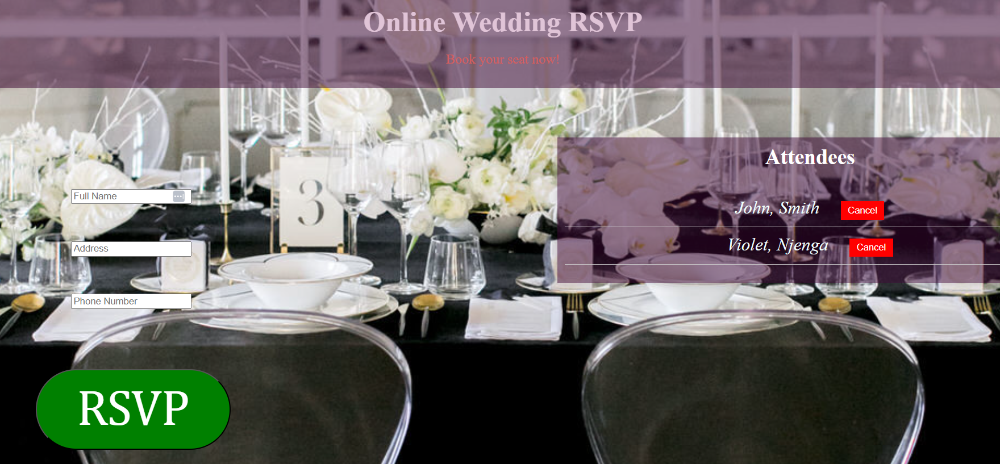

# Wedding RSVP

## Project Overview

A simple RSVP application that allows users to submit their details, view existing attendees, and cancel their reservations. This app interacts with a mock server to store and manage attendee data.


## Features
- Submit RSVP form with full name, address, and phone number.
- View a list of attendees.
- Cancel a reservation by removing an attendee from the list.


## Technologies Used
- **Frontend**: HTML, CSS, JavaScript
- **Backend**: Mock API 


## Table of Contents
- [Installation](#installation)
- [Usage](#usage)
- [Technologies](#technologies)
- [Features](#features)


## Installation

To run this project locally, follow these steps:

1. Clone the repository:
   ```bash
   git clone https://github.com/your-username/rsvp-application.git

2.  Navigate into the project directory:
    cd wedding_rsvp

3. Install the necessary dependencies:
    npm install
    
4. Set up environment variables: i.e. Add a db.json file in the root directory and prepare the file for new information.

5. Run the project:
    npm install -g json-server,
    json-server --watch db.json


6. This will start the server, and you can view the application in your browser at http://localhost:3000.


## Usage
-Once the project is running locally, open your browser and navigate to http://localhost:3000. You will be able to:

-Input your personal information.

-View an immediate confirmation of your submission as well as other attendees of the event.

-View error messages if all fields are not entered.

-Cancel your reservation if you change your mind for any reservation. Below is a screenshot of the landing page;



## Technologies 

Frontend: HTML, CSS, JavaScript

Backend: Node.js


## About Me
Hello! 👋 I'm Chad, a developer in training studying at Moringa School. I specialize in front-end development using JavaScript, and I enjoy building projects that solve real-world problems and provide meaningful experiences for users.

I started working on the Wedding RSVP application as a passion project in school and to improve my coding skills. I wanted to create a platform where users can easily confirm and cancel reservations for upcoming weddings. This project has been a great learning experience and an opportunity to improve my skills in Javascript.

When I'm not coding, I enjoy exploring new technologies, playing video games, and watching movies.


## Skills:
Languages: JavaScript, HTML, CSS

Tools: Git, npm


## Contact

If you have any questions, suggestions or general feedback, feel free to reach out to me:

**Email:** [chadwick.koo2@student.moringaschool.com](mailto:chadwick.koo2@student.moringaschool.com)


